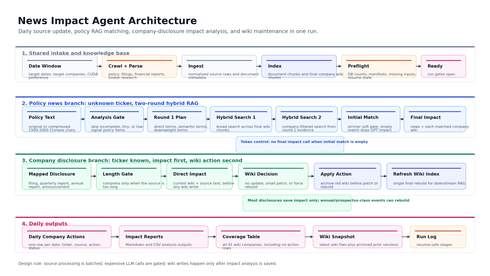

# News Impact Agent

News Impact Agent is an agentic financial research pipeline that turns newly ingested policy news, company disclosures, financial reports, and broker research into stock-level impact analysis and continuously maintained company wikis.

The project is designed around a simple definition:

> Given a date range and a covered stock universe, collect and parse new information, identify which companies are plausibly affected, analyze the impact against durable company knowledge, and update the company wiki only when the new source changes the investable understanding of the business.

The implementation focuses on Chinese A-share workflows, but the architecture is general: source ingestion, document indexing, hybrid RAG matching, per-company impact reasoning, wiki patch/rebuild decisions, and daily coverage outputs.

The core project lives in:

```text
daily_news_impact_pipeline/
```

## What It Does

Given a date range, the pipeline is designed to:

1. Collect and parse policy news, company disclosures, financial reports, prospectuses, and research reports.
2. Ingest company documents into a searchable wiki/document database.
3. Run policy-news impact analysis through a two-round hybrid RAG matching process.
4. Run company-disclosure impact analysis directly against the mapped company wiki.
5. Decide whether a wiki needs no update, a small patch, or a reduced wiki rebuild.
6. Archive old wiki versions and rebuild the final wiki RAG index.
7. Produce daily company action tables and 41-company coverage reports.

## Architecture At A Glance



The detailed branch diagrams are in the project README:

- policy news impact branch
- company disclosure impact branch
- reduced and full wiki build routes

## Main Documents

- [Daily Pipeline README](daily_news_impact_pipeline/README.md)
- [Wiki Build Agent Design](daily_news_impact_pipeline/WIKI_BUILD_AGENT.md)
- [Curated Examples](daily_news_impact_pipeline/examples/README.md)

## Code Map

```text
daily_news_impact_pipeline/
  run_daily_news_impact_one_click.py
  show_wiki_build_plan.py
  daily_news_impact/
    cli.py
    source_update.py
    preflight.py
    impact.py
    force_rebuild.py
    reports.py
    wiki_build_agent/
  examples/
```

## Example Outputs

The `examples/` directory includes:

- sample full company wikis
- sample reduced company wikis
- a matched policy-news impact trace
- a policy no-match skip trace
- company-disclosure small-update, force-rebuild, and no-update cases
- reduced wiki rebuild intermediate artifacts
- daily action and coverage tables

These examples are curated from real pipeline runs and keep the important execution artifacts while excluding raw API requests and raw provider responses.

## Status

This is a design-and-engineering showcase repository. Some source collectors and database adapters are represented as explicit interfaces or command adapters because the original production environment depends on local data sources and credentials.
