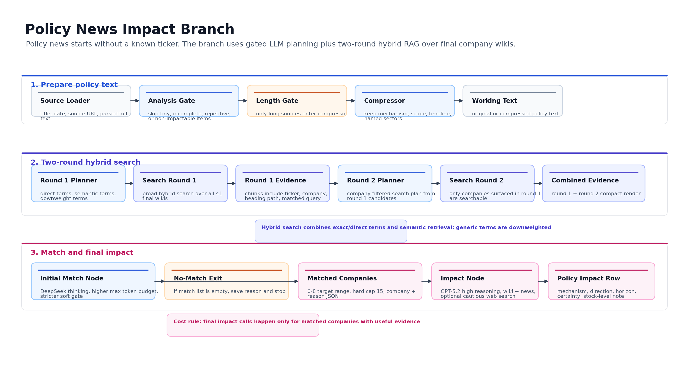

# Daily News Impact One-Click Pipeline

## 目标

这个目录封装一个日度总控 pipeline。给定中国自然日日期范围，它完成：

1. policy news 抓取、解析、入库。
2. 公司披露、财报、招股书、个股研报抓取、解析、入库。
3. 公司文档库 ingest/index，embedding 优先使用 CUDA。
4. policy news impact 分析。
5. company disclosure impact 分析。
6. 根据 impact 决策执行 wiki small patch 或 reduced wiki rebuild。
7. 统一重建 41 公司 news-impact wiki RAG index。
8. 按日期保存每只股票的动作表、impact 汇总和最新 wiki snapshot。

主入口：

```powershell
python daily_news_impact_pipeline\run_daily_news_impact_one_click.py `
  --date-from 2026-04-25 `
  --date-to 2026-04-28 `
  --device cuda `
  --run-id daily_news_impact_20260425_20260428_r1 `
  --continue-on-error
```

## 目录结构

```text
daily_news_impact_pipeline/
  run_daily_news_impact_one_click.py
  show_wiki_build_plan.py     # 离线展示 reduced/full wiki builder plan
  README.md
  WIKI_BUILD_AGENT.md
  examples/                  # curated wiki and news-impact outputs for project review
  daily_news_impact/
    cli.py                 # 总控 CLI 和 stage 编排
    source_update.py       # source crawler/parser/ingest/index command adapter
    preflight.py           # 数据库和 wiki/index 状态检查
    impact.py              # policy/company disclosure impact adapters
    force_rebuild.py       # reduced wiki rebuild 全链路
    reports.py             # 每日股票动作表、impact 汇总、wiki snapshot
    utils.py               # JSON/CSV/stage runner/命令执行工具
    wiki_build_agent/      # wiki build agent 的 reduced/full 设计与可复用接口
      contracts.py
      source_selection.py
      reduced.py
      full.py
      orchestrator.py
```

这个目录拥有自己的 stage runner、resume、daily output、force rebuild、apply rebuild 逻辑。source crawler/parser 当前通过明确的 command adapter 调用仓库里已有 collector CLI，因为这些 CLI 是实际抓取和解析能力的入口。迁移成独立 repo 时，需要把这些 collector CLI 一并迁移，或替换 `source_update.py` 的 command adapter。

Wiki build agent 的详细设计见：

```text
daily_news_impact_pipeline/WIKI_BUILD_AGENT.md
```

代表性样例见：

```text
daily_news_impact_pipeline/examples/README.md
```

## Workflow

### Overall Daily Pipeline

The diagram assets are generated by `scripts/render_architecture_assets.py`.


The daily run has four layers:

- shared intake and knowledge base update
- policy news impact branch
- company disclosure impact branch
- daily outputs and wiki snapshot publication

### Policy News Impact Branch



Policy news starts without a known ticker. The branch first decides whether the news is worth analyzing, then runs two-round hybrid search over the 41-company final wiki index. The initial match node is the expensive narrowing point. If it returns no matched company, the final impact node is skipped.

### Company Disclosure Impact Branch


Company disclosures already map to one company, so the branch skips initial RAG matching. It always saves impact first. Wiki updates happen after impact analysis, and most disclosures should result in `no_update`.

## Stage 说明

### 01 Source Update

默认 source categories：

```text
policy cninfo eastmoney ingest index
```

含义：

- `policy`: 抓取政策新闻，解析 policy text/chunks，默认 policy 不做 embedding。
- `cninfo`: 抓取公司公告、财报、招股书。
- `eastmoney`: 抓取个股研报。
- `ingest`: 将公司披露和研报写入 `data/wiki/wiki_agent.sqlite`。
- `index`: 对 wiki database 做 preflight/index，embedding 按 `--device` 选择，`cuda` 优先。

可以传 doc family 精确更新：

```powershell
--source-categories annual_report quarterly_report_q1 stock_report
```

doc family 会自动补齐需要的 source、ingest、index。

### 03 Policy Impact

调用 policy impact date-range runner。关键节约 token 规则：

- analysis gate 判定 low-signal 时跳过。
- initial match 为空时跳过 GPT final impact。
- final impact 只分析前 `--policy-max-impact-companies` 家，默认 5。

### 04 Company Disclosure Impact

公司披露天然一对一 company，不跑 policy RAG initial match。流程：

1. source loader
2. length gate
3. compressor if needed
4. company disclosure impact node
5. wiki decision

wiki decision：

- `no_update`: 只保存 impact。
- `small_update`: impact 后执行 local wiki patch。
- `force_rebuild`: impact 后记录 rebuild marker，统一进入 Stage 05。

同一个 ticker 在同一 run 有 `force_rebuild` 时，该 ticker 其他 `small_update` 会保留 impact 分析并 defer wiki patch，由 reduced wiki rebuild 覆盖。

### 05 Force Rebuild Wiki

这个 stage 在本目录内完整封装：

1. `write_brainstormer_inputs`
2. Qwen brainstormer API
3. `write_model_inputs`
4. Moonshot/Kimi batch create
5. batch poll/fetch/materialize
6. apply rebuilt wiki
7. archive old wiki
8. update `manifest.csv`
9. rebuild news-impact wiki index

Source 选择规则复用 reduced wiki builder：

- 最新 `annual_report` 作为 `primary_annual_report`。
- 最新 Q1/Q3/半年报作为 `latest_periodic_like`，包括 catalog 里 doc_family 是 `announcement` 但标题是实际季报/半年报的文件。
- 招股书/招股说明书作为 `origin_document`。
- 近期重要公告按事件族聚类选择。
- 近期研报只作为二级语境。

## Wiki Build Agent

本项目把公司 wiki 当成 news impact agent 的基础知识对象。wiki 需要服务两个任务：

1. RAG 初筛时能被检索到：公司名、别名、产品、技术、客户、供应商、项目、资产、地理、行业词、阶段词、触发词都要显式保留。
2. 最终 impact 分析时能被理解：公司的商业模式、价值链位置、盈利驱动、资产负债压力、事件敏感性、确定性边界要清楚。

封装目录里新增了 `daily_news_impact/wiki_build_agent/`，用于表达 reduced/full 两条 wiki builder 路线的工程结构。

### Reduced Builder

Reduced 是日度 pipeline 默认路线，用于 company disclosure impact 之后的 `force_rebuild`。

典型触发：

- 新年报。
- 新招股书或募集说明书。
- 非常重大的披露导致原 wiki 的 source set 明显过期。

核心流程：

```text
document catalog
  -> source selection
  -> retrieval brainstormer
  -> hybrid source package builder
  -> reduced wiki writer
  -> apply/archive/manifest/index
```

source roles：

- `primary_annual_report`: 最新真实年报。
- `latest_periodic_like`: 最新真实 Q1/Q3/半年报/年报，过滤摘要、提示性公告、更正、修订、取消等文件。
- `origin_document`: 招股书、招股说明书、募集说明书。
- `recent_material_announcement`: 近期重大公告，按订单、客户、项目、产能、融资、控制权、风险等事件族聚类选择。
- `secondary_research_context`: 近期个股研报，只用于二级语境、行业词、触发变量和研究框架。

实现入口：

```text
daily_news_impact/wiki_build_agent/source_selection.py
daily_news_impact/wiki_build_agent/reduced.py
daily_news_impact/force_rebuild.py
```

`force_rebuild.py` 是当前生产执行路径；`wiki_build_agent/reduced.py` 把 builder 的 stage contract、质量标准和输出标准显式化，方便 review 和开源展示。

### Full Builder

Full 是重研究路线，适合新公司首次建库、高质量人工复核、复杂公司深度理解。它比 reduced 更贵、更慢，默认不在日度 pipeline 里自动跑。

核心流程：

```text
corpus preflight
  -> anchor and company brief
  -> research router
  -> four planner research tracks
  -> committed evidence bank
  -> round draft and critic
  -> valuation stage
  -> final writer
  -> publish/index
```

默认 research tracks：

- `company_map`: 公司身份、实体、别名、设施、控制权、范围边界。
- `business_engine`: 产品、技术路线、产能、客户、交付路径、赚钱机制。
- `economics_quality`: 收入结构、利润率、现金流、集中度、资本开支、减值、盈利质量。
- `recent_delta_and_risks`: 近期变化、未解决事项、时点依赖、外部触发。

Full builder 会形成 evidence bank，再进入 draft、critic、valuation、final writer。valuation stage 的作用是帮助理解商业质量和敏感性，避免使用当前股价、目标价、市场涨跌幅作为事实锚。

实现入口：

```text
daily_news_impact/wiki_build_agent/full.py
daily_news_impact/wiki_build_agent/orchestrator.py
```

`orchestrator.py` 提供 `build_wiki_build_plan(mode=...)`，可以生成 reduced 或 full 的结构化计划。这个接口当前主要用于展示、测试和后续迁移；日度真实执行仍由 `cli.py` 编排并调用 `force_rebuild.py`。

离线查看 builder 计划：

```powershell
python daily_news_impact_pipeline\show_wiki_build_plan.py --mode reduced --ticker 002796 --company 世嘉科技
python daily_news_impact_pipeline\show_wiki_build_plan.py --mode full --ticker 002796 --company 世嘉科技
```

### 07 Daily Outputs

每个日期都有一张公司动作表：

```text
reports/daily_news_impact_runs/<run_id>/07_daily_outputs/outputs/by_date/<YYYY-MM-DD>/company_actions.csv
reports/daily_news_impact_runs/<run_id>/07_daily_outputs/outputs/by_date/<YYYY-MM-DD>/company_actions.md
```

总表：

```text
reports/daily_news_impact_runs/<run_id>/07_daily_outputs/outputs/daily_all_company_actions.csv
reports/daily_news_impact_runs/<run_id>/07_daily_outputs/outputs/daily_all_company_actions.md
reports/daily_news_impact_runs/<run_id>/07_daily_outputs/outputs/daily_company_coverage.csv
reports/daily_news_impact_runs/<run_id>/07_daily_outputs/outputs/daily_company_coverage.md
```

核心列：

- `date`
- `ticker`
- `company`
- `source_type`
- `source_id`
- `title`
- `action_type`
- `impact_direction`
- `certainty`
- `impact_nature`
- `wiki_action`
- `wiki_path`
- `archive_path`
- `impact_report_path`
- `url`
- `notes`

打开这张表即可看到日期范围内 41 支 final wiki 股票的全部 impact 分析和 wiki 动作。

`daily_company_coverage.csv` 是固定覆盖表：每个日期固定 41 行。没有动作的股票也会出现，`has_action=false`，方便快速确认某天 41 支股票是否有 policy impact、公司披露 impact 或 wiki 变动。

## 输出目录

默认：

```text
reports/daily_news_impact_runs/<run_id>/
```

关键文件：

```text
run_config.json
run_summary.json
01_source_update/
02_preflight/
03_policy_impact/
04_company_disclosure_impact/
05_force_rebuild_wiki/
06_final_wiki_index/
07_daily_outputs/
```

最终日报：

```text
07_daily_outputs/outputs/daily_all_company_actions.csv
07_daily_outputs/outputs/daily_all_company_actions.md
07_daily_outputs/outputs/daily_company_coverage.csv
07_daily_outputs/outputs/daily_company_coverage.md
07_daily_outputs/outputs/daily_all_impacts.md
07_daily_outputs/outputs/by_date/<YYYY-MM-DD>/company_actions.csv
07_daily_outputs/outputs/by_date/<YYYY-MM-DD>/company_coverage.csv
07_daily_outputs/outputs/daily_wiki_snapshots/<YYYY-MM-DD>/
```

`daily_wiki_snapshots/<date>/` 会保存当天 run 完成后的 latest wiki collection 和 manifest。日期范围一次性运行时，每个日期都会保存同一份最终 snapshot；如果需要严格的逐日 end-of-day wiki 状态，应每天单独运行一次。

## Examples

`examples/` 放了几类已跑通样例，便于 review 项目逻辑：

- full wiki sample：长文 wiki，展示重研究路线最终产物。
- reduced wiki sample：日度 pipeline 默认 wiki 形态。
- policy matched sample：policy -> two-round hybrid RAG -> initial match -> impact report。
- policy no-match sample：policy 完成搜索后没有具体公司路径，跳过 final impact。
- company disclosure small-update sample：披露 impact 后执行 wiki 小补丁。
- company disclosure force-rebuild sample：年报 impact 后进入 reduced wiki rebuild。
- company disclosure no-update sample：公告 impact 后判断无需修改 wiki。
- daily output sample：每天、每公司动作表和 41 公司覆盖表。

样例入口：

```text
daily_news_impact_pipeline/examples/README.md
```

## Resume

每个 stage 都有：

```text
input.json
output.json
status.json
```

同一个 `--run-id` 重跑时默认 resume：

- `status=completed/skipped` 的 stage 会复用 output。
- 失败 stage 会重新执行。
- force rebuild 的 batch stage 会复用已存在的 batch manifest 和 writer outputs，避免重复提交 batch。

禁用 resume：

```powershell
--no-resume
```

## 常用命令

### Dry Run

不打 LLM，不抓取，只生成计划、检查现有库、写空/计划产物：

```powershell
python daily_news_impact_pipeline\run_daily_news_impact_one_click.py `
  --date-from 2026-04-28 `
  --date-to 2026-04-28 `
  --run-id daily_news_impact_20260428_dryrun `
  --dry-run `
  --skip-wiki-snapshot
```

### 完整日度运行

```powershell
python daily_news_impact_pipeline\run_daily_news_impact_one_click.py `
  --date-from 2026-04-28 `
  --date-to 2026-04-28 `
  --run-id daily_news_impact_20260428_r1 `
  --device cuda `
  --continue-on-error
```

### 已经入库，只跑 impact 和 wiki update

```powershell
python daily_news_impact_pipeline\run_daily_news_impact_one_click.py `
  --date-from 2026-04-28 `
  --date-to 2026-04-28 `
  --run-id daily_news_impact_20260428_impact_only_r1 `
  --skip-source-update `
  --device cuda `
  --continue-on-error
```

### 只验证 source update 计划

```powershell
python daily_news_impact_pipeline\run_daily_news_impact_one_click.py `
  --date-from 2026-04-28 `
  --date-to 2026-04-28 `
  --run-id daily_news_impact_20260428_source_plan `
  --dry-run `
  --skip-policy-impact `
  --skip-company-disclosure-impact `
  --skip-force-rebuild `
  --skip-final-index `
  --skip-wiki-snapshot
```

## API Keys

需要的 key 来自环境变量或 repo `.env`：

```text
DEEPSEEK_API_KEY / deepseek_api_key
OPENAI_API_KEY / openai_api_key
MOONSHOT_API_KEY / moonshot_api_key
QWEN_API_KEY / qwen_api_key
```

## 质量约束

- impact 永远先于 wiki patch/rebuild。
- small patch 和 force rebuild 都 archive 旧 wiki。
- force rebuild 使用更新后的文档库重新选择 source。
- final wiki index 使用 `--device auto/cuda/cpu`，生产建议 `cuda`。
- policy parse 默认不做 embedding，避免日常 source update 在 policy 分支浪费本地 embedding 时间。
- company disclosure、财报、招股书、研报入 wiki database 时保留 embedding/indexing。
