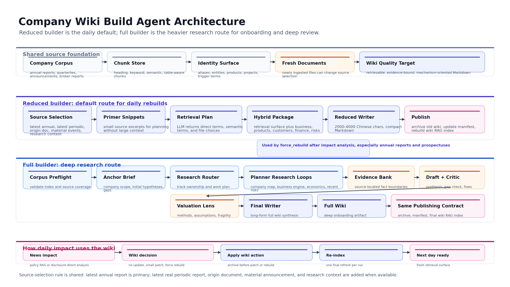
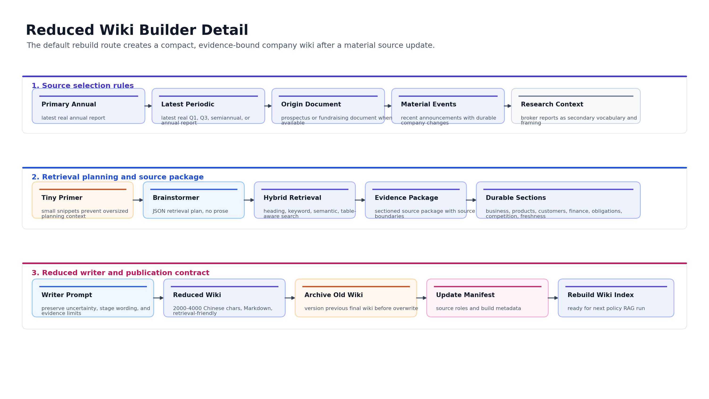
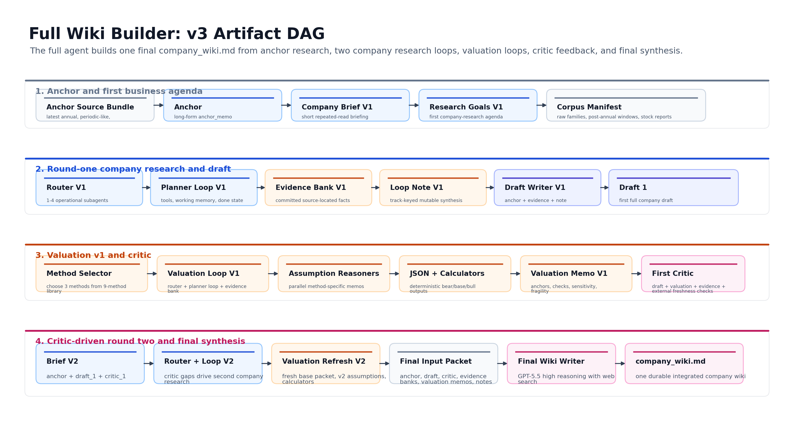
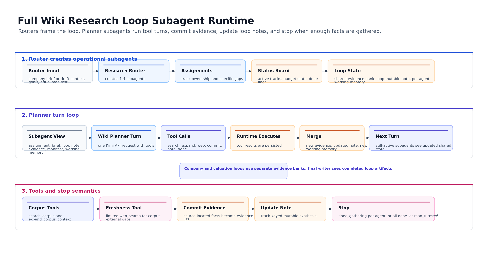
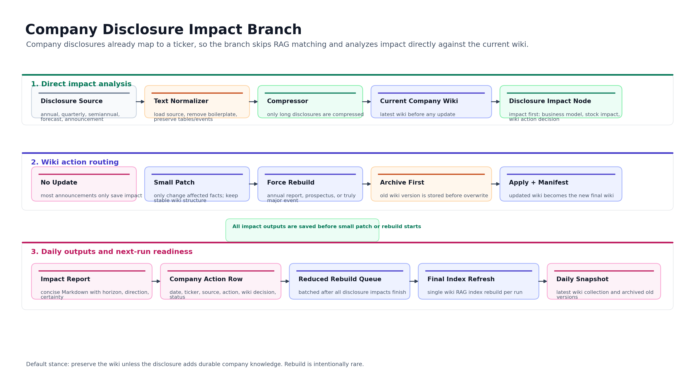

# Wiki Build Agent Design

This document explains the Company Wiki builder used by the daily news impact system. It is written as an engineering design note for review and open-source presentation. The production default is the reduced builder. The full builder is documented as a high-budget extension for deep company onboarding and higher-quality review.

## Why The Wiki Exists

The news impact agent needs an LLM company wiki: a durable company knowledge object designed for retrieval and reasoning. A useful wiki must let another agent answer:

- What the company actually sells, owns, operates, or controls.
- Where the company sits in the value chain.
- Which customers, suppliers, products, projects, assets, technologies, geographies, entities, and aliases future news may mention.
- Which operating variables change earnings, balance-sheet pressure, valuation sensitivity, or event risk.
- Which facts are fresh, stale, uncertain, broker-only, or explicitly undisclosed.

The LLM company wiki is therefore a retrieval and reasoning asset. It is not a marketing profile.

## Two Build Modes



The builder is documented at two levels:

- an overview showing shared source foundation, reduced/full routes, and publishing contract
- detail diagrams for the reduced and full builders

### Reduced Wiki Builder

Reduced is the default daily pipeline builder.

Use it when:

- A new annual report, prospectus, or materially important disclosure means the current wiki source set has changed.
- The daily company-disclosure impact branch has already analyzed impact and marked the company for `force_rebuild`.
- The system needs a fast but evidence-bound rebuild that can be indexed for policy and disclosure impact analysis.

Output target:

- 2000-4000 Chinese characters.
- Markdown.
- Compact enough for frequent rebuilds.
- Dense enough for downstream hybrid search and final impact reasoning.

Reduced builder architecture:



Source roles:

| Role | Selection Rule | Purpose |
|---|---|---|
| `primary_annual_report` | Latest actual annual report | Main primary evidence for business, segment, risk, and financial anchors |
| `latest_periodic_like` | Latest real Q1/Q3/semiannual/annual report after filtering abstracts, prompt notices, corrections, and cancellations | Fresh operating and financial delta |
| `origin_document` | Latest prospectus, prospectus-like fundraising document, or offering memorandum | Durable origin detail, product route, capacity, history, and use-of-proceeds context |
| `recent_material_announcement` | Recent announcement with material event signals | Orders, customers, capacity, M&A, financing, control, risks, operating data |
| `secondary_research_context` | Recent broker research with enough text | Secondary framing, vocabulary, trigger variables, and competitive lens |

The source-selection implementation is in [`source_selection.py`](daily_news_impact/wiki_build_agent/source_selection.py).

Retrieval brainstormer:

- Receives company identity, fixed retrieval sessions, tiny primer snippets, and available files.
- Returns JSON only.
- Selects company-specific search terms, semantic queries, and a small number of optional source files.
- Does not write wiki prose.

Hybrid source package:

- Direct heading/keyword retrieval catches exact disclosures.
- Semantic retrieval catches concept-level matches.
- Tables and small titled sections are preserved when possible.
- Evidence is organized into durable sections:
  - Retrieval Surface
  - Business And Value Chain
  - Products Assets Projects
  - Customers Suppliers Counterparties
  - Financial Segments Quality
  - Capital Transactions And Obligations
  - Industry Competition Triggers
  - Freshness Recent Events

Reduced writer:

- Writes the final wiki from the source package only.
- Keeps broker research clearly secondary.
- Preserves stage wording such as sample, validation, small-batch, trial production, under construction, planned, proposed, pending approval, and undisclosed.
- Avoids unsupported claims about customers, suppliers, rankings, use of proceeds, project status, capacity, or future progress.

The reduced builder plan is represented in [`reduced.py`](daily_news_impact/wiki_build_agent/reduced.py).

### Full Wiki Builder

Full is the high-budget research-loop route. The daily pipeline defaults to reduced rebuilds; full builds are used when a company needs first-time onboarding, manual deep review, or a richer long-form wiki.

The full builder is described in detail in [`FULL_WIKI_BUILD_AGENT.md`](FULL_WIKI_BUILD_AGENT.md), including prompt contracts for anchor memo, research router, planner loops, critic, valuation nodes, and final writer.

Architecturally, the full builder is similar to a LangGraph/ReAct hybrid: a deterministic DAG controls stage order and artifact contracts, while planner subagents run tool-using research turns inside bounded loops.

Use it when:

- A company is being onboarded for the first time.
- A manual deep build is needed.
- The project wants a long-form wiki with explicit evidence bank, research trace, and valuation lens.
- Quality review shows the reduced source package is too thin for a complex company.

Output target:

- Long-form Markdown company wiki.
- Evidence-backed business model, mechanism, economics, recent delta, risks, and valuation relevance.
- More expensive and slower than reduced.

Full builder architecture:



Research loop subagent runtime:



Default research tracks:

| Track | Mission |
|---|---|
| `company_map` | Identity surface, entities, aliases, facilities, ownership/control hooks, scope boundaries |
| `business_engine` | Products, technology routes, capacity, customers, delivery path, monetization mechanism |
| `economics_quality` | Revenue mix, margin/cash-flow anchors, concentration, capital intensity, impairment, earnings quality |
| `recent_delta_and_risks` | Recent changes, open issues, timing dependencies, external triggers |

Full builder nodes:

1. Corpus Preflight  
   Validates local documents, chunks, hybrid search index, and valuation data availability before LLM calls.

2. Anchor And Company Brief  
   Creates a stable orientation memo: company scope, key terms, initial hypotheses, and obvious gaps.

3. Research Router  
   Assigns work to the fixed research tracks and can adapt ownership to the company.

4. Planner Research Loops  
   Agents use local hybrid search first, then limited web search only for freshness-sensitive gaps. The output is a committed evidence bank with source locator and quote/fact boundaries.

5. Round Draft And Critic  
   A draft writer synthesizes the business read. A critic checks unsupported inference, missing mechanism, stale facts, and downstream usefulness.

6. Valuation Stage  
   Selects valuation methods, reasons through assumptions, writes structured assumptions JSON, runs calculator outputs, and prepares a valuation memo. The valuation stage avoids current stock price, target prices, and market-price upside framing.

7. Final Writer  
   Produces one final wiki by auditing the prior draft, critic notes, valuation memo, evidence bank, and final research note.

The full builder plan is represented in [`full.py`](daily_news_impact/wiki_build_agent/full.py).

## How Daily Pipeline Uses Wiki Builds

Company disclosure impact always runs before any wiki change.



The daily pipeline uses reduced rebuild for `force_rebuild` because annual reports and prospectuses usually change the best source set. The reduced builder re-runs source selection against the already updated document database, so a newly ingested annual report can become the new `primary_annual_report`.

## Code Map

```text
daily_news_impact_pipeline/
  WIKI_BUILD_AGENT.md
  examples/
    wikis/
    news_impact/
    wiki_rebuild/
    daily_outputs/
  daily_news_impact/
    wiki_build_agent/
      contracts.py          # shared dataclasses and execution contracts
      source_selection.py   # reduced builder source-role selection rules
      reduced.py            # default reduced builder stage plan
      full.py               # heavy full builder stage plan
      orchestrator.py       # build_wiki_build_plan() and mode descriptions
    force_rebuild.py        # production reduced rebuild execution inside daily pipeline
```

`force_rebuild.py` is the executable reduced rebuild path currently used by the daily pipeline. The `wiki_build_agent` package makes the design explicit, reviewable, and portable.

## Examples

Curated wiki build and news impact outputs are stored in:

```text
daily_news_impact_pipeline/examples/
```

Useful wiki examples:

- `examples/wikis/full/603162__full_wiki.md`
- `examples/wikis/full/688668__full_wiki.md`
- `examples/wikis/reduced/002796__reduced_wiki.md`
- `examples/wikis/reduced/300504__reduced_wiki.md`
- `examples/wikis/reduced/300308__reduced_wiki.md`

Useful rebuild trace:

- `examples/wiki_rebuild/reduced_force_rebuild_002796/02_brainstormer_output.json`
- `examples/wiki_rebuild/reduced_force_rebuild_002796/03_writer_model_input.md`
- `examples/wiki_rebuild/reduced_force_rebuild_002796/05_writer_output.md`
- `examples/wiki_rebuild/reduced_force_rebuild_002796/06_apply_rebuild_summary.json`

These samples show how the design moves from selected documents and retrieval terms into a source package, then into a final wiki that can be indexed for news impact analysis.

## Quality Rules

- Primary filings and announcements control factual wording.
- Broker research is secondary unless the statement is explicitly broker-only.
- Missing detail stays missing. The writer should say the selected text does not provide the detail when evidence is incomplete.
- Recency matters when facts conflict.
- A wiki should expose retrieval handles: names, aliases, products, technologies, projects, customers, suppliers, geographies, stages, and trigger terms.
- Wiki rebuilds and patches are archived before replacement.
- Index rebuild happens once at the end of the daily run when possible.
